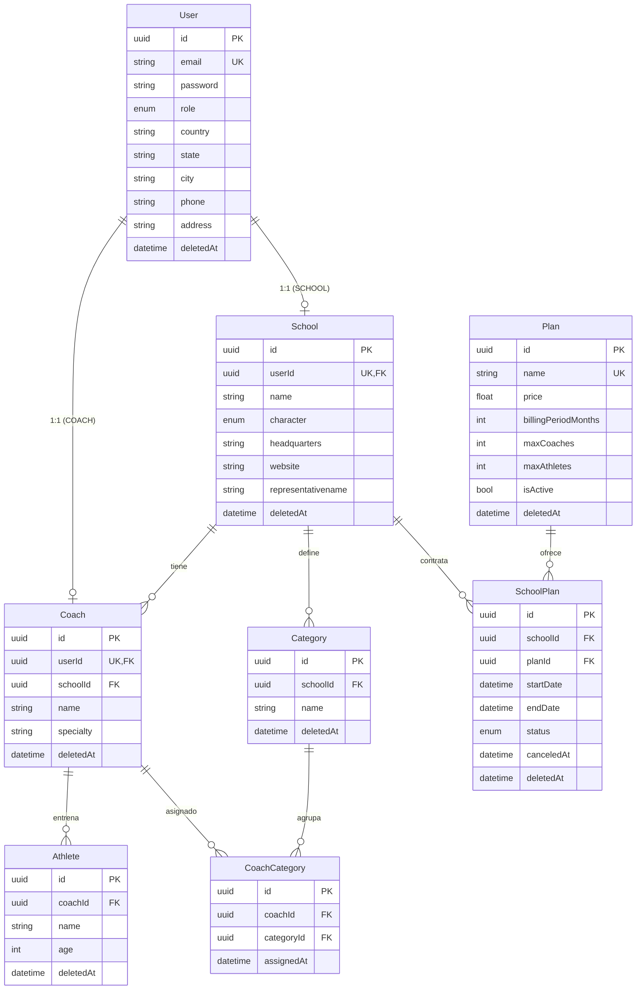

# Base de datos — Micovi

Documentación del modelo relacional de **Back Micovi**: instituciones deportivas (escuelas), entrenadores, deportistas, categorías y facturación por planes.

**Fuente de verdad:** `prisma/schema.prisma`  
**Motor:** PostgreSQL 15  
**ORM:** Prisma

---

## 1. Contexto de negocio

Micovi gestiona el ecosistema de una institución deportiva:

| Actor | Rol en sistema | Tabla principal |
|-------|----------------|-----------------|
| Administrador de plataforma | `ADMIN` | `User` |
| Institución deportiva | `SCHOOL` | `User` + `School` |
| Entrenador | `COACH` | `User` + `Coach` |
| Deportista | `ATHLETE` *(enum definido, sin tabla User aún)* | `Athlete` |

Flujo principal:

1. Una **escuela** se registra → crea `User` (rol `SCHOOL`) + `School`.
2. La escuela contrata un **plan** → registro en `SchoolPlan` (suscripción).
3. La escuela tiene **categorías** (ej. Sub-15, Femenino) y **entrenadores**.
4. Los entrenadores se asignan a categorías vía `CoachCategory`.
5. Los **deportistas** pertenecen a un entrenador.

---

## 2. Diagrama entidad-relación



---

## 3. Tablas y campos

### `User` — Identidad y autenticación

| Campo | Tipo | Restricciones | Notas |
|-------|------|---------------|-------|
| `id` | UUID | PK | |
| `email` | TEXT | UNIQUE, NOT NULL | Login único |
| `password` | TEXT | NOT NULL | Hash (scrypt) |
| `role` | `Role` | NOT NULL | `ADMIN`, `SCHOOL`, `COACH`, `ATHLETE` |
| `country`, `state`, `city`, `phone`, `address` | TEXT | NULL | Datos de contacto del usuario |
| `createdAt`, `updatedAt` | TIMESTAMP | | Auditoría |
| `deletedAt` | TIMESTAMP | NULL | Soft delete |

**Relaciones opcionales 1:1:** `school`, `coach` (según rol).

---

### `School` — Institución deportiva

| Campo | Tipo | Restricciones | Notas |
|-------|------|---------------|-------|
| `id` | UUID | PK | |
| `name` | TEXT | NOT NULL | Nombre de la institución |
| `userId` | UUID | UNIQUE, FK → `User` | Dueño/cuenta de la escuela |
| `character` | `Character` | NOT NULL | `PUBLIC` o `PRIVATE` |
| `headquarters` | TEXT | NULL | Sede principal |
| `website` | TEXT | NULL | |
| `representativename` | TEXT | NULL | Nombre del representante legal |
| `deletedAt` | TIMESTAMP | NULL | Soft delete |

> **Nota histórica:** `address` y `phone` estuvieron en `School` y se movieron a `User` (migración `20260701040724`).

---

### `Coach` — Entrenador

| Campo | Tipo | Restricciones | Notas |
|-------|------|---------------|-------|
| `id` | UUID | PK | |
| `name` | TEXT | NOT NULL | |
| `specialty` | TEXT | NOT NULL | Especialidad deportiva |
| `userId` | UUID | UNIQUE, FK → `User` | Cuenta del entrenador |
| `schoolId` | UUID | FK → `School` | Escuela donde trabaja |
| `deletedAt` | TIMESTAMP | NULL | Soft delete |

Un entrenador pertenece a **una sola escuela**. Un usuario solo puede ser un entrenador (`userId` unique).

---

### `Athlete` — Deportista

| Campo | Tipo | Restricciones | Notas |
|-------|------|---------------|-------|
| `id` | UUID | PK | |
| `name` | TEXT | NOT NULL | |
| `age` | INT | NOT NULL | |
| `coachId` | UUID | FK → `Coach` | Entrenador asignado |
| `deletedAt` | TIMESTAMP | NULL | Soft delete |

> **Importante:** No hay FK a `User` ni a `Category`. El rol `ATHLETE` existe en el enum pero aún no se modela cuenta de usuario para deportistas.

---

### `Category` — Categoría deportiva (por escuela)

| Campo | Tipo | Restricciones | Notas |
|-------|------|---------------|-------|
| `id` | UUID | PK | |
| `name` | TEXT | NOT NULL | Ej. "Sub-17 Masculino" |
| `schoolId` | UUID | FK → `School` | Pertenece a una escuela |
| `deletedAt` | TIMESTAMP | NULL | Soft delete |

---

### `CoachCategory` — Asignación entrenador ↔ categoría (N:M)

| Campo | Tipo | Restricciones | Notas |
|-------|------|---------------|-------|
| `id` | UUID | PK | |
| `coachId` | UUID | FK → `Coach` | |
| `categoryId` | UUID | FK → `Category` | |
| `assignedAt` | TIMESTAMP | DEFAULT now() | Fecha de asignación |

**Índices:**
- UNIQUE `(coachId, categoryId)` — evita duplicar la misma asignación
- INDEX en `coachId` y `categoryId`

Reemplazó la tabla implícita `_CoachCategories` de Prisma (migración `20251111064601`).

---

### `Plan` — Catálogo de planes comerciales

| Campo | Tipo | Restricciones | Notas |
|-------|------|---------------|-------|
| `id` | UUID | PK | |
| `name` | TEXT | UNIQUE, NOT NULL | |
| `description` | TEXT | NOT NULL | |
| `price` | FLOAT | NOT NULL | |
| `billingPeriodMonths` | INT | DEFAULT 1 | Duración del ciclo de facturación |
| `maxCoaches` | INT | NULL | Límite de entrenadores (`null` = ilimitado) |
| `maxAthletes` | INT | NULL | Límite de deportistas (`null` = ilimitado) |
| `isActive` | BOOLEAN | DEFAULT true | Plan disponible para nuevas suscripciones |
| `deletedAt` | TIMESTAMP | NULL | Soft delete |

---

### `SchoolPlan` — Suscripción escuela ↔ plan

| Campo | Tipo | Restricciones | Notas |
|-------|------|---------------|-------|
| `id` | UUID | PK | |
| `schoolId` | UUID | FK → `School` | |
| `planId` | UUID | FK → `Plan` | |
| `startDate` | TIMESTAMP | NOT NULL | Inicio de vigencia |
| `endDate` | TIMESTAMP | NOT NULL | Fin de vigencia |
| `status` | `SubscriptionStatus` | DEFAULT `ACTIVE` | Ver enum abajo |
| `canceledAt` | TIMESTAMP | NULL | Fecha efectiva de cancelación |
| `deletedAt` | TIMESTAMP | NULL | Soft delete |

---

## 4. Enumeraciones

### `Role`
| Valor | Uso |
|-------|-----|
| `ADMIN` | Administrador de la plataforma |
| `SCHOOL` | Cuenta de institución |
| `COACH` | Cuenta de entrenador |
| `ATHLETE` | Reservado; sin implementación completa en BD |

### `Character`
| Valor | Uso |
|-------|-----|
| `PUBLIC` | Institución pública |
| `PRIVATE` | Institución privada |

### `SubscriptionStatus`
| Valor | Uso |
|-------|-----|
| `ACTIVE` | Suscripción vigente en el rango `startDate`–`endDate` |
| `SCHEDULED` | Programada para iniciar en el futuro |
| `CANCELED` | Cancelada antes de `endDate` |
| `EXPIRED` | Finalizada (natural o por cancelación en fecha de fin) |

---

## 5. Relaciones y cardinalidad

```
User 1 ──── 0..1 School     (userId unique en School)
User 1 ──── 0..1 Coach      (userId unique en Coach)

School 1 ──── * Coach
School 1 ──── * Category
School 1 ──── * SchoolPlan

Coach * ──── * Category      (vía CoachCategory)
Coach 1 ──── * Athlete

Plan 1 ──── * SchoolPlan
```

### Política de borrado (FK)

Todas las FK usan `ON DELETE RESTRICT` y `ON UPDATE CASCADE`.  
No se puede eliminar físicamente un registro padre si tiene hijos referenciados. El patrón esperado es **soft delete** (`deletedAt`).

---

## 6. Reglas de negocio implementadas

### Autenticación y registro

| Regla | Dónde se aplica |
|-------|-----------------|
| Email único por usuario | UNIQUE en `User.email` + `EmailAlreadyInUseException` |
| Registro de escuela crea `User` + `School` en transacción | `RegisterSchoolHandler` + `UnitOfWork` |
| Datos de contacto van en `User`, no en `School` | `RegisterSchoolHandler` |

### Planes y suscripciones

| Regla | Dónde se aplica |
|-------|-----------------|
| Nombre de plan único | UNIQUE en `Plan.name` + handler |
| Solo planes activos se pueden asignar | `AssignPlanToSchoolHandler` |
| `endDate` debe ser posterior a `startDate` | `AssignPlanToSchoolHandler` |
| No puede haber dos suscripciones `SCHEDULED` solapadas | `ensureNoScheduledOverlap` |
| Al asignar plan nuevo, la suscripción activa se acorta | `shortenActiveSubscription` |
| Suscripción futura → status `SCHEDULED`; inmediata → `ACTIVE` | `AssignPlanToSchoolHandler` |
| Cancelación valida pertenencia a la escuela y estado | `CancelSubscriptionHandler` |
| Límites de coaches/atletas se **consultan** pero no se **bloquean** al crear | `GetPlanStatusHandler` (`withinLimits`) |

### Consultas habituales en repositorios

- Filtro `deletedAt: null` en lecturas de `User`, `School`, `Plan`, `SchoolPlan`.
- Suscripción actual: `status = ACTIVE` + `startDate <= hoy` + `endDate >= hoy`.
- Métricas de uso: cuenta coaches de la escuela y atletas cuyo coach pertenece a esa escuela.

---

## 7. Evolución del esquema (migraciones)

| Migración | Cambio relevante |
|-----------|------------------|
| `20251111055636` | Esquema inicial en español (`Usuario`, `Escuela`, etc.) |
| `20251111063512` | Renombre a inglés, soft delete, `Category`, `Athlete.categoryId`, tabla implícita `_CoachCategories` |
| `20251111064601` | `CoachCategory` explícita; se elimina `Athlete.categoryId`; se quitan varios índices |
| `20260701040724` | `Character`, `SubscriptionStatus`, límites en `Plan`, contacto en `User`, campos extra en `School` |

---

## 8. Riesgos y brechas detectadas

Usa esta sección como checklist al diseñar nuevas features o migraciones.

### 🔴 Alta prioridad

| # | Problema | Impacto | Sugerencia |
|---|----------|---------|------------|
| 1 | **`Athlete` sin `userId`** pero existe rol `ATHLETE` | Deportistas no pueden autenticarse; rol huérfano | Agregar `userId` opcional/unique en `Athlete` o tabla intermedia |
| 2 | **`Athlete` sin relación con `Category`** | Se eliminó `categoryId`; categorías solo vinculan coaches | Definir si el deportista pertenece a categoría directamente o vía coach; restaurar FK si aplica |
| 3 | **Límites de plan no se enforced** | Escuela puede exceder `maxCoaches`/`maxAthletes` | Validar en handler de alta de coach/athlete o trigger/check |
| 4 | **Sin validación DB de coherencia CoachCategory** | Coach de escuela A podría asignarse a categoría de escuela B | CHECK o validación en aplicación: `coach.schoolId === category.schoolId` |

### 🟡 Media prioridad

| # | Problema | Impacto | Sugerencia |
|---|----------|---------|------------|
| 5 | **Índices FK eliminados** (`Coach.schoolId`, `Category.schoolId`, `SchoolPlan.*`) | Consultas más lentas con volumen | Re-agregar índices en FKs de consulta frecuente |
| 6 | **Sin UNIQUE en `Category(name, schoolId)`** | Nombres duplicados de categoría en la misma escuela | Restaurar índice compuesto único |
| 7 | **Solapamiento de suscripciones ACTIVE** | Solo controlado en código, no en BD | Constraint de exclusión PostgreSQL o índice parcial único |
| 8 | **`representativename` sin camelCase** | Inconsistencia de naming | Renombrar a `representativeName` en migración futura |
| 9 | **`age` como entero** | Envejece mal; requiere actualización manual | Considerar `birthDate` |

### 🟢 Baja prioridad / diseño

| # | Observación | Sugerencia |
|---|-------------|------------|
| 10 | Soft delete sin índices parciales | Índices `WHERE deletedAt IS NULL` para consultas activas |
| 11 | `price` como FLOAT | Usar `Decimal` para dinero |
| 12 | Un `User` no puede ser School y Coach a la vez | Correcto por diseño; documentar explícitamente |
| 13 | `Plan.deletedAt` vs `isActive` | Definir cuándo usar cada uno (borrado lógico vs despublicar) |

---

## 9. Consultas útiles para diagnóstico

### Suscripción activa de una escuela
```sql
SELECT sp.*, p.name AS plan_name
FROM "SchoolPlan" sp
JOIN "Plan" p ON p.id = sp."planId"
WHERE sp."schoolId" = '<school-uuid>'
  AND sp."deletedAt" IS NULL
  AND sp.status = 'ACTIVE'
  AND sp."startDate" <= NOW()
  AND sp."endDate" >= NOW()
ORDER BY sp."startDate" DESC
LIMIT 1;
```

### Uso vs límites del plan
```sql
SELECT
  s.id AS school_id,
  s.name AS school_name,
  p."maxCoaches",
  p."maxAthletes",
  (SELECT COUNT(*) FROM "Coach" c WHERE c."schoolId" = s.id AND c."deletedAt" IS NULL) AS coaches,
  (SELECT COUNT(*) FROM "Athlete" a
   JOIN "Coach" c ON c.id = a."coachId"
   WHERE c."schoolId" = s.id AND a."deletedAt" IS NULL AND c."deletedAt" IS NULL) AS athletes
FROM "School" s
LEFT JOIN "SchoolPlan" sp ON sp."schoolId" = s.id AND sp.status = 'ACTIVE' AND sp."deletedAt" IS NULL
LEFT JOIN "Plan" p ON p.id = sp."planId"
WHERE s."deletedAt" IS NULL;
```

### Asignaciones coach-categoría de escuelas distintas (anomalía)
```sql
SELECT cc.id, co."schoolId" AS coach_school, ca."schoolId" AS category_school
FROM "CoachCategory" cc
JOIN "Coach" co ON co.id = cc."coachId"
JOIN "Category" ca ON ca.id = cc."categoryId"
WHERE co."schoolId" <> ca."schoolId";
```

### Coaches sin categoría asignada
```sql
SELECT c.*
FROM "Coach" c
LEFT JOIN "CoachCategory" cc ON cc."coachId" = c.id
WHERE c."deletedAt" IS NULL
  AND cc.id IS NULL;
```

---

## 10. Convenciones del proyecto

| Convención | Detalle |
|------------|---------|
| IDs | UUID v4 (`@default(uuid())`) |
| Timestamps | `createdAt`, `updatedAt` automáticos |
| Borrado | Preferir `deletedAt` sobre `DELETE` físico |
| Naming | Tablas y columnas en inglés, PascalCase en Prisma |
| Fuente de verdad del esquema | `prisma/schema.prisma` — nunca editar la BD manualmente sin migración |

### Comandos de referencia

```bash
# Ver estado del esquema
npx prisma migrate status

# Explorar datos visualmente
npx prisma studio

# Generar cliente tras cambios
npx prisma generate
```

---

## 11. Próximos pasos sugeridos (modelo)

Orden recomendado según impacto en la lógica de negocio:

1. **Definir modelo de deportista:** ¿tendrá cuenta (`User` + `ATHLETE`)? ¿Pertenece a categoría?
2. **Enforzar límites del plan** al registrar coach/athlete.
3. **Restaurar integridad CoachCategory ↔ School** (misma escuela).
4. **Reindexar FKs** usadas en listados y reportes.
5. **Evaluar `birthDate`** en lugar de `age` para deportistas.

---

*Última revisión basada en `prisma/schema.prisma` y migraciones hasta `20260701040724`.*
